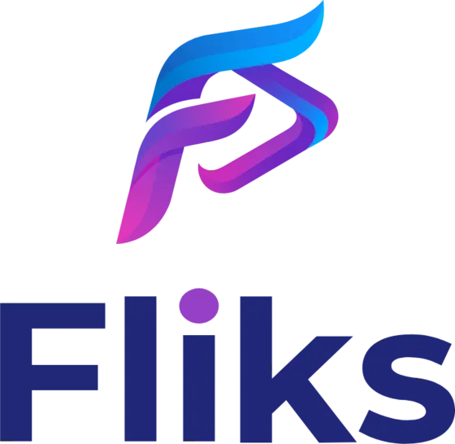
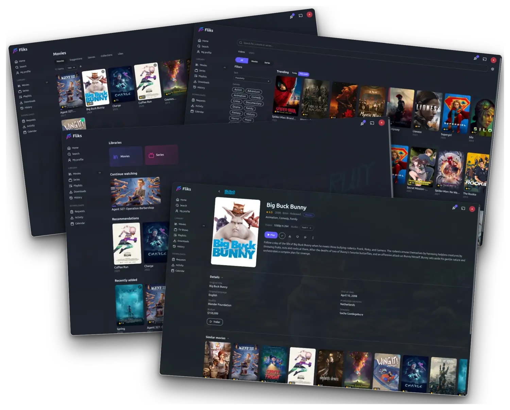

<p align="center">
  <picture>
    <source media="(prefers-color-scheme: dark)" srcset=".github/readme/logo-stacked-dark.webp">
    
  </picture>
</p>

<p align="center">
  <b>Your personal video collection, on every screen in the house.</b>
</p>

Point Fliks at the folders where your videos live and it does the rest:
covers, descriptions, cast, seasons and episodes, laid out like the
streaming apps you already use — except the library is yours.

It turns a folder of video files into a proper streaming service for the
household. Everyone gets their own profile and their own place in every
episode; start something on your phone, sit down, and the TV picks it up
where you left off. It plays on whatever screen is in front of you, and
converts the video on the fly when that screen can't handle the original
file.

Self-hosted: the server runs on your machine, there is no account to
create, no subscription, and nothing leaves the house.

- **Server** — Docker, a Windows tray app or a macOS menu-bar app
- **Clients** — web, iOS, Android, Android TV, Apple TV, Samsung, LG, desktop, Chromecast
- **License** — [AGPL-3.0-or-later](LICENSE)

<p align="center">
  
</p>

---

## Get started

The server runs on one machine in the house — the one holding your video
files. Everything else connects to it. Three ways to install it; they
give you the same Fliks, so pick whichever suits the machine. All you
need is a folder with your videos and about two minutes.

### Windows

Download the installer from the
[latest release](https://github.com/fliks-app/fliks/releases) and run it.
Fliks sits in the system tray and starts with the machine. Nothing else
to install. Details in [`windows/`](windows/).

### macOS

Download the `.dmg` from the
[latest release](https://github.com/fliks-app/fliks/releases) and drag it
to Applications. Fliks sits in the menu bar. Apple Silicon, macOS 13
Ventura or newer. Details in [`macos/`](macos/).

### Docker — Linux, NAS, or a home server

```bash
curl -LO https://raw.githubusercontent.com/fliks-app/fliks/main/docker-compose.example.yml
mv docker-compose.example.yml docker-compose.yml
```

Open the file and set three things:

1. `POSTGRES_PASSWORD` and `DB_PASSWORD` — the same real password
2. the `/path/to/your/media:/medias:ro` mount — where your files are
3. `PORT` — only if `4848` is taken on the host

```bash
docker compose up -d
```

### First run

Whichever you picked, open `http://<host>:4848` in a browser — on the
machine itself that's `http://localhost:4848`. Sign in with the account
Fliks creates on its first boot:

| Username | Password |
|---|---|
| `admin` | `password` |

Change that password right away — user menu → **Account**. Then add a
library pointing at your video folder (`/medias` under Docker), and Fliks
scans it and goes looking for the covers.

Then install the app on your phone or TV, point it at the same address,
and you're done.

---

## Server compatibility

| How you run it | Platforms | Hardware transcoding | Ships with |
|---|---|---|---|
| **Docker** *(recommended)* | `linux/amd64`, `linux/arm64` | Intel QSV · VAAPI · NVIDIA NVENC · AMD | backend, web client, FFmpeg |
| **Windows** — tray app, NSIS installer | Windows x64 | Intel QSV · AMD AMF · NVIDIA NVENC, auto-detected | everything, no dependencies |
| **macOS** — menu-bar app, `.dmg` | macOS 13 Ventura+, Apple Silicon | VideoToolbox | everything, no dependencies |
| **From source** | anywhere Node runs | whatever your FFmpeg exposes | — |

The image is a single container: NestJS backend, the built Angular
client served as static assets, and a self-contained
[jellyfin-ffmpeg](https://github.com/jellyfin/jellyfin-ffmpeg) build. A
PostgreSQL container sits beside it (the example Compose pins 18.3).

### Encoders

Which hardware path is available depends on the machine, not on Fliks —
it probes at startup and falls back to CPU when nothing else answers.

| Codec | CPU | Intel QSV | VAAPI | NVIDIA NVENC | AMD AMF | VideoToolbox |
|---|:-:|:-:|:-:|:-:|:-:|:-:|
| H.264 | ✅ | ✅ | ✅ | ✅ | ✅ | ✅ |
| HEVC | ✅ | ✅ | ✅ | ✅ | ✅ | ✅ |
| AV1 | ✅ | ✅ | ✅ | ✅ | ✅ | — |

HDR10, HLG and Dolby Vision are tone-mapped to SDR when the receiving
device can't render them.

---

## Client compatibility

One Angular codebase ships as the web app and as the mobile / TV apps,
so every screen gets the same features — adapted to its input (touch,
mouse, D-pad). Apple TV is the exception: tvOS has no WebView, so it has
its own native SwiftUI app talking to the same backend.

| Client | Where to get it | Minimum | Notes |
|---|---|---|---|
| **Web / PWA** | your browser, at the server URL | any current browser | installable to the home screen |
| **iOS · iPadOS** | App Store | iOS 14 | |
| **Android** | Play Store | Android 6 (API 23) | phone + tablet |
| **Android TV** | Play Store | Android 6 | 10-foot UI, D-pad navigation |
| **Samsung TV (Tizen)** | sideload for now | Tizen 5.5 — 2020 sets and newer | works fully, not yet on Samsung Apps |
| **LG TV (webOS)** | LG Content Store | built for Chromium 85 | approved, on the store |
| **Desktop** | release assets | macOS: Apple Silicon | Windows `.exe`, macOS `.dmg`, Linux `.deb` / AppImage |
| **Chromecast** | built in — cast from any client | — | custom receiver, same player engine |
| **Apple TV** | App Store — same app record as iOS | tvOS 17 | native SwiftUI app, not the web client |

The desktop app is a thin client with an mpv video pipeline — it
connects to your server like the mobile apps do, it doesn't host one.

---

## What you get

### Watching

- **Adaptive streaming** — quality follows the bandwidth without a
  hiccup, or lock a bitrate by hand when you'd rather decide.
- **Resume anywhere** — start on the phone, finish on the TV; the
  position syncs live.
- **Every track, switchable mid-playback** — all embedded audio
  renditions, all embedded and external subtitles (`.srt`, `.ass`), with
  your choice remembered per show.
- **Subtitles found for you** — a video that came without any? Fliks
  goes looking on the usual subtitle sites and picks the one that
  actually matches your copy, in the languages you asked for.
- **Out of sync, fixed in one click** — Fliks listens to the dialogue
  and slides the subtitles back onto it. No hunting for the right
  offset, no re-downloading three files hoping one lands.
- **Translated on demand** — nothing available in your language? Take a
  track you do have and have it translated into one you can read. You
  bring the translation service; the result is saved next to the video
  so it's only done once.
- **Subtitle appearance** per user: size, colour, shadow, background
  opacity, margins.
- **Skip intro, next episode, chapter markers** and thumbnail previews
  when you scrub.

### Browsing

- **Several libraries side by side** — movies, shows, home videos, kids —
  each pointed at its own folder.
- **Search across all of them**, filter and sort by status, date added,
  rating, runtime.
- **Metadata from TMDB / TVDB**: posters, fanart, genres, cast and crew.
  Every person is a page listing everything they worked on in your
  libraries; every genre is a filter.
- **Home rows** — Continue Watching, Recently Added, and
  recommendations weighted by what you've actually watched.
- **Calendar** of upcoming episodes for the series you follow.
- **Spoiler protection** — an account-wide switch that blurs the
  synopsis of a film, a season or an episode you haven't watched, along
  with an unwatched episode's thumbnail and backdrop, and shows
  *Episode 3* in place of a title that gives the plot away. Click a
  masked item to reveal it, or mark it as watched and it unmasks for
  good. Each of the three is its own toggle, and the setting follows
  your account onto every device.

### Sharing with the household

- **Recommend something to someone** — pick a film or a season and send
  it to another user. It shows up on their home page under *Recommended
  for you*, with your name on it.
- **Playlists** — your own running order, drag to reorder, autoplay from
  one item to the next, and watched items drop off on their own if you
  want them to.
- **Shared playlists** — invite other users as viewer, editor or admin
  and build one together, or save someone else's public playlist to your
  own list.
- **Downloads that keep themselves current** — turn a playlist to
  automatic on your phone, tablet or the desktop app: what you haven't
  watched is downloaded to the device, and what you have watched is
  removed to give the space back. Nothing to think about before a flight.
- **Everyone stays in control** — each user decides whether their
  profile is public and what appears on it: tastes, recent activity,
  favourites, statistics — or nothing at all.

### Running it

- **Multi-user**, each with their own history, progress and preferences.
- **Pairing by QR code or short code** — the TV picks up the session
  from your phone.
- **Live transcode dashboard** for admins: who's watching what, at which
  quality, on which hardware path, and why a transcode was needed.
- **Images cached locally** — no hotlinking to external services while
  you browse.

---

## Hosting notes

### Pinning a version

`:latest` follows the most recent stable release. Pin a specific tag
(`:1.2.3`) from the
[package list](https://github.com/fliks-app/fliks/pkgs/container/fliks).

### Hardware acceleration in Docker

Intel QSV and VAAPI work out of the box once you uncomment the
`/dev/dri` device mount in the example Compose. NVIDIA NVENC needs
`nvidia-container-toolkit` on the host and a slightly different Compose
snippet — the example Compose carries both, commented.

### The data volume was renamed

The volume that holds artwork, seek-preview sprites, extracted subtitles
and uploaded avatars is now `/app/data` (`fliks_data`), not `/app/images`.
It was never only images, and it is not a cache: the avatars in it cannot
be re-fetched.

**Existing installs need no change.** `FLIKS_IMAGES_DIR` still works, and
a volume still mounted at `/app/images` is detected and used as-is — the
boot log names it once so you know you are on the old path.

To move onto the new name, copy before removing anything:

```bash
docker compose down
docker volume create fliks_data
docker run --rm -v fliks_images:/from -v fliks_data:/to alpine sh -c 'cp -a /from/. /to/'
# in your Compose file: `- fliks_data:/app/data` replaces `- fliks_images:/app/images`
docker compose up -d
docker volume rm fliks_images   # only once the boot log stops naming the old path
```

With a bind mount instead of a named volume, `mv` the host directory and
update the left side of the mapping.

### Update checks

Fliks asks the **public GitHub releases API** whether a newer version
exists: the server does it to tell admins their install is behind, the
desktop app to offer in-app updates. One unauthenticated read, cached
for hours — no token, no telemetry, nothing sent about you.

Set `FLIKS_DISABLE_UPDATE_CHECK=1` to turn it off; `/api/system/update`
then always reports "up to date" and never contacts GitHub.

---

## Repository layout

| Path | What lives there |
|---|---|
| `backend/` | NestJS, TypeORM, PostgreSQL, the FFmpeg pipeline |
| `client/` | Angular + Tailwind / DaisyUI + Shaka Player — web, iOS, Android, Android TV (Capacitor), plus the Tizen and webOS packagers |
| `desktop/` | Electron + libmpv thin client for Windows / macOS / Linux |
| `windows/`, `macos/` | native server hosts (tray / menu bar) |
| `appletv/` | native tvOS app (SwiftUI) |
| `cast-receiver/` | custom Chromecast receiver |
| `docs/plugins.md` | how the plugin system works, for whoever writes one |

## License

[AGPL-3.0-or-later](LICENSE) — run a modified version on a network and
you owe its users the modified source.
