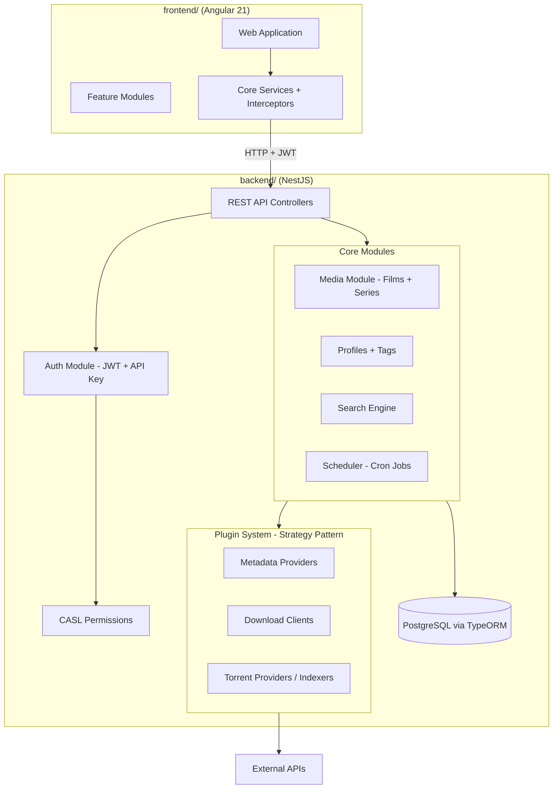
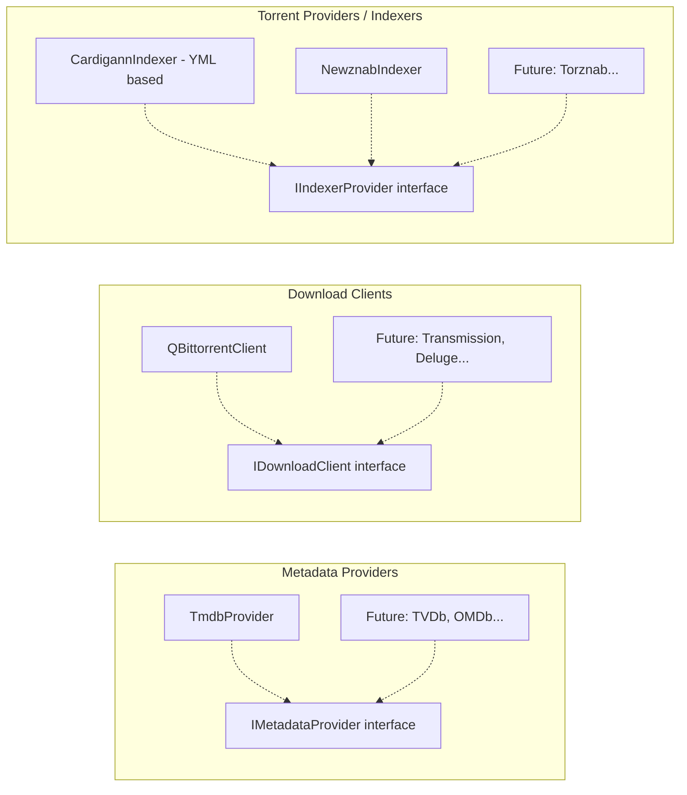
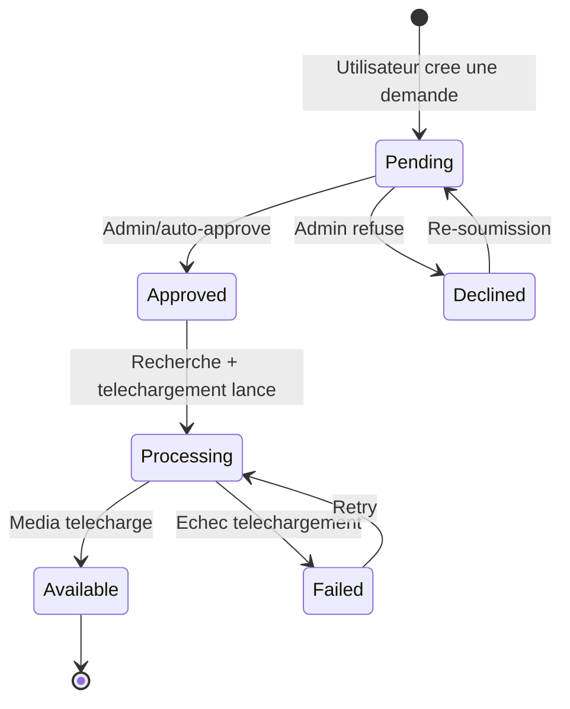

# Plan de developpement Suitarr

## 1. Architecture globale

Deux projets separes dans le meme dossier parent, chacun avec son propre `package.json`, ses propres dependances et son propre repo git potentiel. Les types/interfaces partages sont dupliques ou extraits dans un package npm local si necessaire.

```
suitarr/
├── backend/                # NestJS backend (projet independant)
│   ├── src/
│   │   ├── main.ts
│   │   ├── app.module.ts
│   │   ├── common/             # Guards, decorators, pipes, interceptors, DTOs partages
│   │   └── modules/
│   │       ├── auth/               # AuthModule (JWT + API Key + CASL)
│   │       ├── users/              # UsersModule
│   │       ├── media/              # MediaModule (films + series)
│   │       ├── profiles/           # QualityProfile, LanguageProfile, CustomFormat
│   │       ├── tags/               # TagsModule
│   │       ├── metadata-providers/ # Plugin system metadata (TMDB, etc.)
│   │       ├── download-clients/   # Plugin system download (qBittorrent, etc.)
│   │       ├── indexers/           # Plugin system indexers (Cardigann, Prowlarr import)
│   │       ├── requests/          # Systeme de demandes (type Jellyseerr)
│   │       └── scheduler/         # Taches cron automatisees
│   ├── docker-compose.yml      # PostgreSQL (dev)
│   ├── package.json
│   ├── tsconfig.json
│   └── nest-cli.json
│
├── frontend/                # Angular 21 frontend (projet independant)
│   ├── src/
│   │   ├── app/
│   │   │   ├── app.component.ts
│   │   │   ├── app.routes.ts
│   │   │   ├── core/           # Guards, interceptors, services globaux
│   │   │   ├── shared/         # Composants, pipes, directives reutilisables
│   │   │   └── features/       # Feature modules (lazy loaded)
│   │   │       ├── movies/
│   │   │       ├── series/
│   │   │       ├── calendar/
│   │   │       ├── activity/
│   │   │       ├── requests/
│   │   │       ├── settings/
│   │   │       └── system/
│   │   ├── environments/
│   │   └── styles/
│   ├── package.json
│   ├── angular.json
│   └── tsconfig.json
│
└── README.md
```




## 2. Backend NestJS - Modules principaux

### 2.1 Auth & Permissions (CASL)

- **AuthModule** : authentification multi-sources (comme Jellyseerr)
  - **Login local** : email/mot de passe classique, JWT pour le frontend, API Key pour les integrations externes
  - **Login via serveur media** : authentification deleguee aux serveurs media configures
    - **Jellyfin** : `POST /Users/AuthenticateByName` puis verification du token
    - **Emby** : `POST /Users/AuthenticateByName` + support EmbyConnect (auth par email)
    - **Plex** : flow PIN OAuth (`POST plex.tv/pins.xml` -> echange contre access token)
  - **Import utilisateurs** : recuperation de la liste des utilisateurs depuis le serveur media
    - Jellyfin/Emby : `GET /Users` (avec token admin)
    - Plex : `GET plex.tv/api/v2/home/users`
    - Les utilisateurs importes recoivent les permissions par defaut configurees dans Settings
  - **Auto-inscription** : un utilisateur ayant acces au serveur media peut se connecter sans import prealable (configurable)
  - Architecture plugin (Strategy Pattern) pour les media servers, comme les autres plugins :
    - Interface `IMediaServerAuth` : `authenticate()`, `getUsers()`, `testConnection()`
    - Implementations : `JellyfinAuthProvider`, `EmbyAuthProvider`, `PlexAuthProvider`
  - `JwtStrategy` et `ApiKeyStrategy` (Passport.js) pour les requetes authentifiees
  - Guard global combinant toutes les strategies
- **CaslModule** : Factory pattern avec `@casl/ability`
  - `CaslAbilityFactory` : construit les abilities selon le role (Admin, User, ReadOnly)
  - `PoliciesGuard` : guard NestJS verifiant les permissions
  - Decorateur `@CheckPolicies()` pour annoter les controllers
  - Actions : `manage`, `create`, `read`, `update`, `delete`
  - Subjects : `Media`, `Library`, `Profile`, `Indexer`, `DownloadClient`, `User`, `Settings`, `Request`

### 2.2 Module Media (Films + Series)

Entites TypeORM principales :

- **Media** : entite de base (titre, overview, annee, type: `movie` | `series`, statut, monitored, path, images, ratings)
- **Season** : (pour series) numero, monitored, statistiques
- **Episode** : (pour series) saison, numero, titre, airDate, monitored
- **MediaFile** : fichier physique lie a un media (qualite, langue, taille, chemin)

### 2.3 Systeme de profils et recherche avancee (comme Radarr/Sonarr)

- **QualityProfile** : liste ordonnee de qualites acceptees, seuils d'upgrade
  - Qualites : SDTV, WEBDL-480p, WEBRip-480p, HDTV-720p, WEBDL-720p, Bluray-720p, WEBDL-1080p, Bluray-1080p, WEBDL-2160p, Bluray-2160p, Remux-1080p, Remux-2160p
- **LanguageProfile** : langues preferees ordonnees par priorite
- **Tag** : systeme de tags generique applicable a Media, Indexer, DownloadClient, Profile
- **CustomFormat** : regles de scoring basees sur des conditions (regex sur nom release, codec, source, etc.)
- **SearchService** : moteur de recherche avec filtres combines (titre, annee, genre, langue, tag, statut, qualite)
  - Utilise PostgreSQL Full-Text Search (`tsvector`, `tsquery`) pour la recherche textuelle avec support multi-langue natif
  - Index GIN sur les colonnes de recherche pour des performances optimales
  - `pg_trgm` (trigrams) pour la recherche floue / fuzzy matching (titres approchants, fautes de frappe)
  - Recherche combinee : full-text + filtres relationnels (tags, profils, statuts) en une seule requete SQL

### 2.4 Plugin System - Architecture Strategy Pattern

Chaque type de plugin utilise une **interface abstraite** + un **registry** injectable :




#### 2.4.1 Metadata Providers (commence par TMDB)

- Interface `IMetadataProvider` : `searchMovie()`, `searchTvShow()`, `getDetails()`, `getImages()`, `getCredits()`
- **TmdbProvider** : implementation TMDB API v3
  - Endpoints : `/search/movie`, `/search/tv`, `/movie/{id}`, `/tv/{id}`, `/discover/movie`, `/discover/tv`
  - Gestion du rate limiting, cache, et multi-langue
  - Config : API Key TMDB stockee en base

#### 2.4.2 Download Clients (commence par qBittorrent)

- Interface `IDownloadClient` : `testConnection()`, `addTorrent()`, `getTorrents()`, `removeTorrent()`, `pauseTorrent()`, `resumeTorrent()`, `getStatus()`
- **QBittorrentClient** : implementation qBittorrent Web API v2
  - Auth : login cookie-based (`/api/v2/auth/login`)
  - Ajout torrents : `/api/v2/torrents/add` (magnet ou fichier .torrent)
  - Monitoring : `/api/v2/torrents/info`, `/api/v2/sync/maindata`
  - Support v5.0+ (stop/start au lieu de pause/resume)

#### 2.4.3 Torrent Providers / Indexers (compatibilite Prowlarr)

- Interface `IIndexerProvider` : `search()`, `testConnection()`, `getCapabilities()`, `download()`
- **CardigannIndexer** : moteur d'execution des fichiers YML Prowlarr/Cardigann
  - Parsing YAML des definitions (header, caps, categories, settings, login, search, download)
  - Support du template engine Cardigann (variables, filtres, conditions)
  - Validation contre `schema.json` des definitions Prowlarr
- **ProwlarrImportService** :
  - Import des fichiers YML depuis le repo Prowlarr/Indexers
  - Import depuis la base SQLite Prowlarr (`prowlarr.db`, table `Indexers`)
  - Mapping des champs Prowlarr vers le modele Suitarr

### 2.5 Systeme de demandes (type Jellyseerr)

Module complet de gestion des demandes avec workflow d'approbation et permissions granulaires via CASL.

#### Workflow de demande




#### Entites

- **Request** : id, userId, mediaType (movie/series), tmdbId, title, status (pending/approved/declined/processing/available/failed), requestedAt, updatedAt, approvedById, declinedReason, qualityProfileId, rootFolder, seasons (jsonb, pour series)
- **RequestComment** : id, requestId, userId, message, createdAt
- **AutoApprovalRule** : id, name, enabled, conditions (jsonb), priority
  - Conditions possibles : role utilisateur, genre du media, annee de sortie, nombre de saisons, utilisateur specifique

#### Permissions CASL pour les demandes

- `Request.create` : tout utilisateur authentifie (avec limites configurables)
- `Request.read` : ses propres demandes (User), toutes les demandes (Admin)
- `Request.approve` / `Request.decline` : Admin uniquement
- `Request.delete` : Admin, ou User sur ses propres demandes en statut pending
- `Request.manage` : gestion complete (Admin)
- **Limites de demandes** : nombre max de demandes par periode configurable par role (ex: 10 films/semaine pour User)
- **Auto-approbation** : regles conditionnelles (par role, genre, annee...) evaluees a la creation de la demande
- **Notifications** : evenements emis lors des changements de statut (approuve, refuse, disponible)

#### Integration avec les autres modules

- A l'approbation, le `SearchService` lance automatiquement la recherche sur les indexers
- Le `SchedulerModule` verifie periodiquement les demandes en statut `processing`
- Le front affiche le statut des demandes sur les fiches media

### 2.6 Scheduler & Automatisation

- **SchedulerModule** : `@nestjs/schedule` pour les taches cron
  - RSS Sync : verification periodique des flux RSS des indexers
  - Search Missing : recherche automatique des medias manquants
  - Refresh Metadata : mise a jour des metadonnees depuis TMDB
  - Disk Scan : detection des fichiers sur disque

## 3. Frontend Angular 21

### 3.1 Stack technique

- Angular 21 (standalone components, zoneless, signals)
- Angular Router avec lazy loading par feature
- State management via Signals + Services
- Tailwind CSS 4.x + daisyUI 5.x pour le design system et les composants UI
- HttpClient avec interceptors pour auth (JWT Bearer header)

### 3.2 Workflow MCP durant le developpement

Les serveurs MCP suivants seront utilises systematiquement :

- **user-angular-cli** :
  - `get_best_practices` : consulte avant toute creation/modification de code Angular pour respecter les conventions Angular 21 (standalone, signals, zoneless, @if/@for/@switch)
  - `search_documentation` : recherche dans la doc officielle Angular 21 pour les APIs et patterns
  - `list_projects` : verification de la structure du projet, prefixe selectors, framework de test
- **user-browser-tools** :
  - `takeScreenshot`, `getConsoleErrors`, `getConsoleLogs` : debug visuel et verification du frontend
  - `runAccessibilityAudit`, `runPerformanceAudit` : audits qualite
- **cursor-ide-browser** :
  - `browser_navigate`, `browser_snapshot`, `browser_click`, `browser_fill` : tests interactifs de l'application dans le navigateur

Note : pas de serveur MCP pour daisyUI -- la doc daisyUI 5.x sera consultee via la documentation web classique.

### 3.2 Pages principales


| Route         | Description                                                                          |
| ------------- | ------------------------------------------------------------------------------------ |
| `/login`      | Page de connexion (local + boutons Jellyfin/Emby/Plex selon config)                  |
| `/movies`     | Bibliotheque films (grille/liste, filtres, tags)                                     |
| `/series`     | Bibliotheque series TV                                                               |
| `/movies/:id` | Detail film (fichiers, historique, recherche manuelle)                               |
| `/series/:id` | Detail serie (saisons, episodes, monitoring)                                         |
| `/add/movie`  | Ajout film (recherche TMDB)                                                          |
| `/add/series` | Ajout serie (recherche TMDB)                                                         |
| `/calendar`   | Calendrier des sorties                                                               |
| `/requests`   | Liste des demandes (filtrable par statut, utilisateur)                               |
| `/activity`   | File d'attente et historique des telechargements                                     |
| `/settings/`* | Sous-pages : Profils qualite, Langues, Indexers, Download Clients, Tags, UI, General |
| `/system`     | Status, logs, taches, mises a jour                                                   |


### 3.3 Composants cles

- **MediaCardComponent** : carte avec poster, titre, annee, statut, qualite
- **FilterBarComponent** : barre de filtres combinables (texte, tags, statut, qualite, langue)
- **QualityProfileEditorComponent** : editeur drag-and-drop des qualites
- **IndexerConfigComponent** : formulaire dynamique genere depuis les settings Cardigann YML

## 4. Base de donnees (PostgreSQL 17 via TypeORM)

PostgreSQL est choisi pour ses capacites de recherche avancee natives :

- **Full-Text Search** : `tsvector`/`tsquery` avec support multi-langue integre (francais, anglais, etc.)
- **Trigrams** (`pg_trgm`) : recherche floue, suggestions, tolerance aux fautes de frappe
- **Index GIN** : performances optimales sur les colonnes de recherche et les champs JSONB
- **JSONB** : stockage natif et requetable pour les champs de configuration (settings indexers, items profils)

Un `docker-compose.yml` a la racine de `backend/` fournit une instance PostgreSQL 17 pour le developpement.

Entites principales :

- `User` : id, username, email, passwordHash, role, apiKey, mediaServerType (local/jellyfin/emby/plex), mediaServerId, avatar, lastLogin
- `MediaServer` : id, name, type (jellyfin/emby/plex), url, apiKey, enabled
- `Media` : id, title, originalTitle, year, type (movie/series), tmdbId, imdbId, overview, status, monitored, path, qualityProfileId, languageProfileId, added, tags, **searchVector (tsvector)**
- `Season` : id, mediaId, seasonNumber, monitored
- `Episode` : id, seasonId, episodeNumber, title, overview, airDate, monitored, **searchVector (tsvector)**
- `MediaFile` : id, mediaId, episodeId?, relativePath, size, quality, language, dateAdded
- `QualityProfile` : id, name, cutoff, items (jsonb)
- `LanguageProfile` : id, name, cutoff, languages (jsonb)
- `Tag` : id, label
- `CustomFormat` : id, name, specifications (jsonb)
- `Indexer` : id, name, implementation, configContract, settings (jsonb), enableRss, enableSearch, priority, tags
- `DownloadClient` : id, name, implementation, settings (jsonb), enable, priority, tags
- `DownloadHistory` : id, mediaId, indexerId, downloadClientId, sourceTitle, quality, language, date, status
- `Request` : id, userId, mediaType, tmdbId, title, status, requestedAt, updatedAt, approvedById, declinedReason, qualityProfileId, rootFolder, seasons (jsonb)
- `RequestComment` : id, requestId, userId, message, createdAt
- `AutoApprovalRule` : id, name, enabled, conditions (jsonb), priority
- `Command` : id, name, status, startedOn, endedOn, trigger

## 5. Phase de bootstrapping initiale

L'implementation initiale suivra cet ordre :

1. **Scaffolding** : Projet NestJS (`backend/`), projet Angular (`frontend/`)
2. **Database** : Entites TypeORM, migrations initiales, seeding
3. **Auth** : Module JWT + API Key, CASL ability factory, guards
4. **Media CRUD** : Module media avec CRUD complet (films + series)
5. **TMDB Provider** : Integration API TMDB pour la recherche et les metadonnees
6. **Profils & Tags** : Quality profiles, language profiles, tags, custom formats
7. **Requests** : Systeme de demandes avec workflow approbation, auto-approval, limites par role, commentaires
8. **Indexer Engine** : Moteur Cardigann YML, import Prowlarr
9. **qBittorrent Client** : Integration du client de telechargement
10. **Scheduler** : Taches automatisees (RSS, search, refresh)
11. **Frontend** : Shell Angular, pages principales, composants UI

